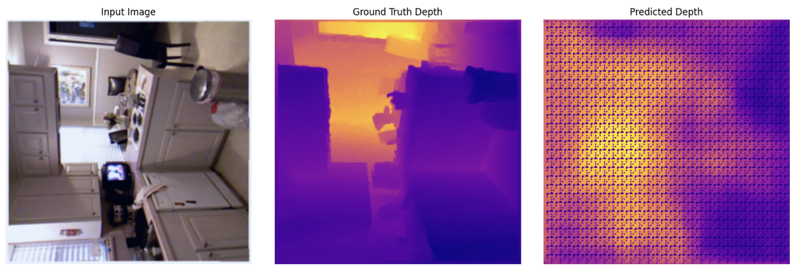
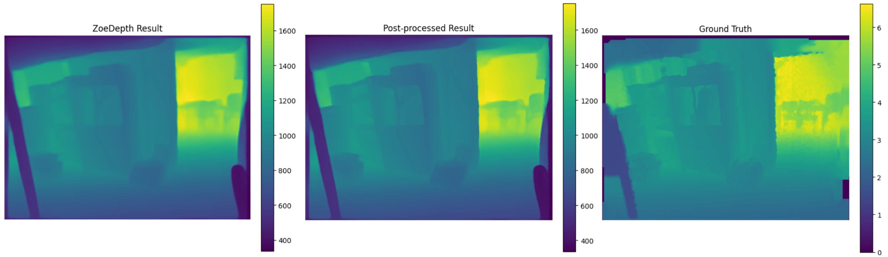
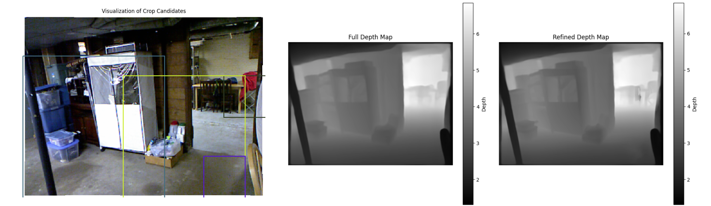

# Advancing-Monocular-Depth-Estimation
This repository features two approaches to monocular depth estimation: the viability of a Vision Transformer (ViT)-based model for fast, low-resolution predictions for real-time applications, and depth enhancement techniques applied to the existing ZoeDepth model for enhanced accuracy with low overhead via edge sharpening, superpixel segmentation, and high-frequency patch refinement.

[Read the full report here](https://spospider.github.io/Advancing-Monocular-Depth-Estimation/AdvMonocularDepth-Report.pdf)

---
## Results Summary
### Vision Transformer (ViT) Model Results

This example illustrates the potential of using a ViT-based approach for depth estimation, focusing on lightweight predictions in resource-constrained settings.

### Edge Sharpening for Boundary Precision
This refinement method enhances the edges and boundaries in the depth map for better definition and accuracy.

### High-Frequency Region Enhancement
This approach improves detail retention in high-frequency regions, capturing intricate depth variations effectively.

---
## Evaluation of Post-Processing Techniques

The table below compares the performance of the baseline ZoeDepth model with our proposed post-processing techniques. Metrics used are **Mean Absolute Error (MAE)** and **Root Mean Square Error (RMSE)**:

| Model                          | MAE   | RMSE   |
|--------------------------------|-------|--------|
| ZoeDepth Baseline              | 0.0973 | 0.1230 |
| Edge Sharpening Pipeline       | 0.0983 | 0.1253 |
| SLIC Segmentation Pipeline     | 0.1056 | 0.1373 |
| High-Freq Patch Refinement     | 0.0959 | 0.1222 |

---

## Contributers
- [Ali Eissa](https://github.com/spospider)
- [Amr AbdelBaky](https://github.com/amrkhaled122)
- [Omar Harb](https://github.com/omarharb02)
- [Sara Mohamed](https://github.com/saraa-mohamedd)
